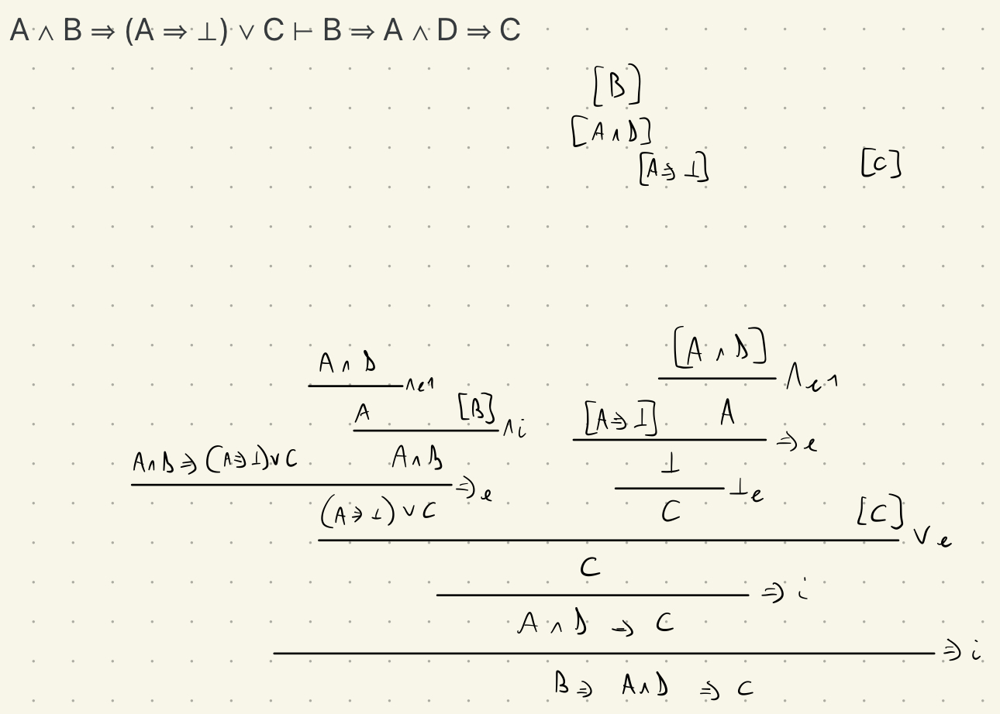

# 07/10/2021

## Es 1
**Teorema**: se X ∩ Y = X allora X ⊆ Y

(Simboli utilizzabili: ∈ ∅ ∪ ∩ ⊆ ∀ ∃ ∧ ∨ ¬ ⇒ ⇔)

**Noi**:

Siano X e Y insiemi tali che X ∩ Y = X,

ovvero, per l'assioma dell'estensionalità, ∀Z, Z ∈ X ∩ Y ⇔ Z ∈ X, (H1)

ovvero, per teorema intersezione binaria, ∀Z, (Z ∈ X ∧ Z ∈ Y) ⇔ Z ∈ X. (H2)

Quindi, ∀Z, (Z ∈ X ∧ Z ∈ Y) ⇔ Z ∈ X. (H3)

Devo dimostrare X ⊆ Y,

ovvero ∀Z, (Z ∈ X ⇒ Z ∈ Y).

Sia Z insieme tale che Z ∈ X,

ovvio per H3 da destra a sinistra.

**Prof**:

Dimostrazione: siano X, Y insiemi t.c. X ∩ Y = X. Quindi, per l'assioma di estensionalità, si ha ∀Z. Z ∈ X ∩ Y ⇔ Z ∈ X (H). Dobbiamo dimostrare X ⊆ Y, ovvero ∀W. W ∈ X ⇒ W ∈ Y. Sia W insieme t.c. W ∈ X. Quindi, per H, si ha W ∈ X ∩ Y. Quindi, per il teorema dell'intersezione binaria, W ∈ X (H1) e W ∈ Y (H2). Dobbiamo dimostrare W ∈ Y. Ovvio per H2. qed.

---

## Es 2
**Teorema**: X ∩ (Y ∪ Z) ⊆ (X ∩ Y) ∪ (X ∩ Z)

(Simboli utilizzabili: ∈ ∅ ∪ ∩ ⊆ ∀ ∃ ∧ ∨ ¬ ⇒ ⇔)

**Noi**:

Siano X, Y, Z insiemi.

Devo dimostrare che X ∩ (Y ∪ Z) ⊆ (X ∩ Y) ∪ (X ∩ Z),

ovvero ∀W, W ∈ X ∩ (Y ∪ Z) ⇒ W ∈ (X ∩ Y) ∪ (X ∩ Z),

ovvero, per il teorema dell'intersezione binaria e dell'unione binaria, ∀W, (W ∈ X ∧ W ∈ (Y ∪ Z)) ⇒ (W ∈ (X ∩ Y) ∨ W ∈ (X ∩ Z)).

Ovvero, per il teorema dell'intersezione binaria e dell'unione binaria, ∀W, (W ∈ X ∧ (W ∈ Y ∨ W ∈ Z)) ⇒ ((W ∈ X ∧ W ∈ Y) ∨ (W ∈ X ∧ W ∈ Z)).

Sia W insieme tale che W ∈ X (H1) e (W ∈ Y (H2) oppure W ∈ Z (H3))

Procedo per casi:
- Suppongo valgano H1 e H2.
  Devo dimostrare che (W ∈ X e W ∈ Y) oppure (W ∈ X e W ∈ Z).
  Ovvio per H1 e H2.

- Suppongo valgano H1 e H3.
  Devo dimostrare che (W ∈ X e W ∈ Y) oppure (W ∈ X e W ∈ Z).
  Ovvio per H1 e H3.

**Prof**:

Dimostrazione: siano X, Y, Z insiemi. Dobbiamo dimostrare X ∩ (Y ∪ Z) ⊆ (X ∩ Y) ∪ (X ∩ Z), ovvero ∀W. W ∈ X ∩ (Y ∪ Z) ⇒ W ∈ (X ∩ Y) ∪ (X ∩ Z). Sia W insieme t.c. W ∈ X ∩ (Y ∪ Z). Quindi, per il teorema dell'intersezione, W ∈ X (H1) e W ∈ Y ∪ Z. Quindi, per l'assioma dell'unione binaria, W ∈ Y o W ∈ Z. Procediamo per casi:
- Caso W ∈ Y (H2): dobbiamo dimostrare W ∈ (X ∩ Y) ∪ (X ∩ Z). Per l'assioma dell'unione binaria, è sufficiente dimostrare W ∈ (X ∩ Y) o W  ∈(X ∩ Z). Dimostriamo W ∈ X ∩ Y.  Per il teorema dell'intersezione binaria è sufficiente dimostrare W ∈ X e W ∈ Y. Ovvio per H1 e H2.
- Caso W ∈ Z (H2):  dobbiamo dimostrare W ∈ (X ∩ Y) ∪ (X ∩ Z).  Per l'assioma dell'unione binaria, è sufficiente dimostrare W ∈ (X ∩ Y) o W ∈ (X ∩ Z).Dimostriamo W ∈ X ∩ Z.  Per il teorema dell'intersezione binaria è sufficiente dimostrare  W ∈ X e W ∈ Z. Ovvio per H1 e H2.

qed.

---

## Es 3

Sia c(W) = { Y ∈ U | ¬(Y ∈ W) } il complementare di W rispetto a U.

**Teorema**: se X ⊆ Y allora c(Y) ⊆ c(X)

(Simboli utilizzabili: ∈ ∅ ∪ ∩ ⊆ ∀ ∃ ∧ ∨ ¬ ⇒ ⇔)

**Noi**:

Siano X, Y insiemi tali che X ⊆ Y,

ovvero ∀Z, Z ∈ X ⇒ Z ∈ Y (H).

Devo dimostrare che c(Y) ⊆ c(X),

ovvero ∀Z, Z ∈ c(Y) ⇒ Z ∈ c(X), 

ovvero ∀Z, ¬(Z ∈ Y) ⇒ ¬(Z ∈ X),

ovvero ∀Z, Z ∈ X ⇒ Z ∈ Y.

Sia Z insieme tale che Z ∈ X. Ovvio per H.

**Prof**:

Dimostrazione: siano X, Y, U insiemi t.c. X ⊆ Y, ovvero ∀Z. Z ∈ X ⇒ Z ∈ Y (H). Dobbiamo dimostrare c(Y) ⊆ c(X), ovvero ∀W. W ∈ c(Y) ⇒ W ∈ c(X). Sia W insieme t.c. W ∈ c(Y). Quindi, per l'assioma di separazione, W ∈ U (H1) e ¬(W ∈ Y) (H2). Dobbiamo dimostrare W ∈ c(X). Per l'assioma di separazione possiamo ridurci a dimostrare W ∈ U e ¬(W ∈ X).

W ∈ U per H1

Supponiamo W ∈ X (K) e dimostriamo l'assurdo. Da K e H si ha W ∈ Y. Quindi, per H2, assurdo.

qed.

---
---
---

# 14/10/2021

## Es 1

**Teorema**: per ogni insieme A e per ogni f,g ∈A^A, se f,g sono funzioni suriettive allora anche h(x) = f(g(x)) lo è.

**Noi**:

Sia A un insieme e siano f, g tale che f ∈ A^A (H1) e g ∈ A^A (H2) e f suriettiva (H3) e g suriettiva (H4).

Per H3 e la definizione di funzione suriettiva,

∀y, ∃x ∈ A, f(x) = y (H3')

Per H4 e la definizione di funzione suriettiva,

∀y, ∃x ∈ A, g(x) = y (H4')

Devo dimostrare che f(g(x)) è suriettiva, ovvero

∀y, ∃x ∈ A, f(g(x)) = y

Sia y insieme tale che ∃x ∈ A, f(g(x)) = y

Sia x ∈ A tale che f(g(x)) = y

**Prof**:

Dimostrazione: sia A un insieme e f,g ∈ A^A t.c. f è suriettiva, ovvero

∀y. y ∈ A ⇒ ∃x. x ∈ A ∧ y = f(x) (Hf) e g è suriettiva, ovvero

∀z. z ∈ A ⇒ ∃w. w ∈ A ∧ z = g(w) (Hg). Dobbiamo dimostrare che h è suriettiva, ovvero

∀v. v ∈ A ⇒ ∃s. s ∈ A ∧ v = f(g(s)).

Sia v t.c. v ∈ A. Quindi, per Hf, ∃x. x ∈ A ∧ v = f(x). Sia x t.c. x ∈ A (H1) e v = f(x) (H2).

Da H1 e Hg si ha ∃w. w ∈ A ∧ x = g(w). Sia w t.c. w ∈ A (H3) e x = g(w) (H4).

Dobbiamo dimostrare ∃s. s ∈ A ∧ v = f(g(s)). Scelgo w e dimostro w ∈ A e v = f(g(w)).

Per H3 w ∈ A.

Per H2 e H4 si ha v = f(g(w)).

qed.

---

## Es 2

sia c(X) = {Y ∈ U | ¬(Y ∈ X)} (il complementare di X rispetto a U)

**Teorema**: se X ⊆ Y allora X ∩ c(Y) = ∅

(Simboli utilizzabili: ∈ ∅ ∪ ∩ ⊆ ∀ ∃ ∧ ∨ ¬ ⇒ ⇔)

**Noi**:

Siano X, Y insiemi tali che X ⊆ Y ovvero ∀Z.Z ∈ X ⇒ Z ∈ Y (H)

devo dimostrare X ∩ c(Y) = ∅

Sia W insieme.

Suppongo W ∈ X ∩ c(Y)

Ovvero, per il teorema dell'intersezione binaria, W ∈ X ∧ W ∈ c(Y)

Ovvero, per definizione di complementare, W ∈ X ∧ ¬(W ∈ Y)

Per (H) W ∈ Y. Quindi W ∈ Y ∧ ¬(W ∈ Y), assurdo.

Quindi X ∩ c(Y) = ∅. qed.

**Prof**:

Dimostrazione: siano X,Y,U insiemi t.c. X ⊆ Y, ovvero ∀Z. Z ∈ X ⇒ Z ∈ Y (H). Dobbiamo dimostrare X ∩ c(Y) = ∅. Per l'assioma di estensionalità ci riduciamo a dimostrare X ∩ c(Y) ⊆ ∅ e ∅ ⊆ X ∩ c(Y).

- ∅ ⊆ X ∩ c(Y) è già stato dimostrato
- Dobbiamo dimostrare X ∩ c(Y) ⊆ ∅, ovvero ∀W. W ∈ X ∩ c(Y) ⇒ W ∈ ∅. Sia W t.c. W ∈ X ∩ c(Y). Quindi, per il teorema dell'intersezione, W ∈ X (H1) e W ∈ c(Y) (H2). Da H1 e H si ha W ∈ Y (H3). Da H2, per l'assioma di separazione, si ha W ∈ U (H4) e ¬(W ∈ Y) (H5). Da H3 e H5 assurdo. Quindi W ∈ ∅.

qed.

---

## Es 3

**Teorema**: per ogni relazione di equivalenza ≡ su A, A ⊆ ∪A/≡

(Simboli utilizzabili: ∈ ∅ ∪ ∩ ⊆ ∀ ∃ ∧ ∨ ¬ ⇒ ⇔)

Suggerimento: utilizzare il teorema che afferma l'esistenza dell'insieme quoziente, la definizione di classi di equivalenza e quella di relazione di equivalenza.

**Noi**:

Sia A un insieme.

Per il teorema dell'esistenza dell'insieme quoziente esiste l'insieme quoziente A/≡ per ogni relazione di equivalenza ≡.

Devo dimostrare che per ogni relazione di equivalenza ≡ su A, A ⊆ ∪A/≡.

Ovvero ∀≡ ∈ A × A, (∀X, X ∈ A ⇒ X ∈ ∪A/≡).

Sia X un insieme tale che X ∈ A.

Per l'assioma dell'unione mi riduco a dimostrare ∃Y ∈ A/≡ tale che X ∈ Y.

Scelgo [X]/≡ e dimostro X ∈ [X]/≡.

Per la definizione di classe di equivalenza, X ∈ [X]/≡ ⟺ X ≡ X

Ovvio. qed.

**Prof**:

Dimostrazione: sia A un insieme e ≡ una relazione di equivalenza su A. Dobbiamo dimostrare A ⊆ ∪A/≡, ovvero ∀Z. Z ∈ A ⇒ Z ∈ ∪A/≡. Sia Z un insieme t.c. Z ∈ A(H). Dobbiamo dimostrare Z ∈ ∪A/≡. Per l'assioma dell'unione ci riduciamo a dimostrare ∃Y. Y ∈ A/≡ ∧ Z ∈ Y. Scelgo [Z]≡. Dobbiamo dimostrare [Z]≡ ∈ A/≡ e Z ∈ [Z]≡.

- Da H e il teorema dell'insieme quoziente si ha [Z]≡ ∈ A/≡.
- Dobbiamo dimostrare Z ∈ [Z]≡. Per l'assioma di separazione è sufficiente dimostrare Z ∈ A e Z ≡ Z.
  - Z ∈ A è ovvio per H
  - Z ≡ Z è ovvio per la proprietà riflessiva di ≡

qed.

---
---
---

# 21/10/2021

**Di questo non mi dà la possibilità di fare la revisione, mi dispiace**

---
---
---

# 28/10/2021

## Es 1

Considerare il seguente algoritmo, noto con il nome di insertion sort, per ordinare una lista di numeri:

isort [] = []
isort (x : l) = insert x (isort l)

dove insert è stata definita nella sessione di allenamento (e su insert sono state dimostrate certe proprietà).

**Teorema**: sorted (isort l)

Simboli utilizzabili: ∀, ∃, ∧, ∨, ¬, ⇒

**Noi**:

Dimostrazione: procediamo per induzione strutturale su l per dimostrare sorted (isort l) = true. caso []: Dobbiamo dimostrare sorted (isort []) = true Ovvero sorted [] = true Ovvio, la lista vuota è sempre ordinata caso x:l: Per ipotesi induttiva sorted (isort l) = true (II) Dobbiamo dimostrare ∀x, sorted (isort x:l) = true Ovvero ∀x, sorted (insert x (isort l)) = true Per la proprietà della funzione sorted dimostrate in precedenza, ∀y, sorted k ⇒ sorted (insert y k). (H1) Fisso x, allora per II sorted (isort l) = true. Per H1 sorted (insert x (isort l)) = true. Qed.

**Prof**:

Dimostrazione: procediamo per induzione strutturale su l per dimostrare
   
sorted (isort l) = true

- caso []:
  dobbiamo dimostrare sorted (isort []) = true
  ovvero sorted [] = true
  ovvero true = true
  ovvio

- caso y : l:
  per ipotesi induttiva sorted (isort l) = true (II)
  dobbiamo dimostrare sorted (isort (y : l)) = true
  ovvero sorted (insert y (isort l)) = true
  ovvio per il teorema 5) dell'esercitazione e II

qed

---

## Es 2

Avete dimostrato che l'output dell'insertion sort di una lista l è ordinato.
Questo non è sufficiente a concludere che l'algoritmo sia corretto: un algoritmo di ordinamento non solo deve restituire una lista ordinata, ma deve garantire che ogni membro della lista in input appaia con la stessa molteplicità nella lista in output, e viceversa.

Esempio: se isort (1 : 3 : 2 : []) restituisse (1 : 2 : []) allora soddisferebbe il teorema dimostrato nell'esercizio precedente, ma sarebbe bacato.

Per dimostrare del tutto corretto il nostro isort, definiamo prima una funzione che conta quante volte un elemento occorre in una lista:

count x [] = 0
count x (y : l) = (if x == y then 1 else 0) + count x l

Esercizio: dimostrare il seguente teorema

**Teorema**: count x l = count x (isort l)

Per dimostrare il teorema servono due lemmi ausiliari che mettono in relazione la count con la insert. Trovare l'enunciato di tali lemmi, ma non dimostrarli. La dimostrazione è reinviata ai prossimo esercizi. Ricordarsi di avere almeno già usato l'ipotesi induttiva prima di identificare il lemma necessario.

Simboli utilizzabili: ∀, ∃, ∧, ∨, ¬, ⇒

**Noi**:

Lemma 1: Se x == m, count x (insert m l) = count x l + 1 Lemma 2: Se x != m, count x (insert m l) = count x l Dimostrazione: procediamo per induzione strutturale su l per dimostrare ∀x, count x l = count x (isort l). caso []: Dobbiamo dimostrare count x [] = count x (isort []) Ovvero count x [] = count x [] Ovvio. caso x:l: Per ipotesi induttiva ∀x, count x l = count x (isort l) (II) Dobbiamo dimostrare ∀x, count x m:l = count x (isort m:l) Ovvero ∀x, (if x == m then 1 else 0) + count x l = count x (insert m (isort l)) Fisso x. Caso x == m: Per II mi riduco a dimostrare 1 + count x (isort l) = count x (insert m (isort l)) Ovvio per lemma 1 Caso x != m: Per II mi riduco a dimostrare count x (isort l) = count x (insert m (isort l)) Ovvio per lemma 2 Qed.

**Prof**:

Dimostrazione: procediamo per induzione strutturale su l per dimostrare

∀x. count x l = count x (isort l)

- caso []:
  dobbiamo dimostrare ∀x. count x [] = count x (isort [])
  ovvero ∀x. 0 = count x []
  ovvero ∀x. 0 = 0
  ovvio

- caso y : l:
    per ipotesi induttiva ∀x. count x l = count x (isort l) (II)
    dobbiamo dimostrare ∀x. count x (y : l) = count x (isort (y : l))
    ovvero ∀x. (if x == y then 1 else 0) + count x l = count x (insert y (isort l))
    sia x un numero naturale
    procediamo per casi:
    - caso x == y (H):
        dobbiamo dimostrare 1 + count x l = count x (insert y (isort l))
        per H ci riduciamo a dimostrare 1 + count x l = count x (insert x (isort l))
        per II ci riduciamo a dimostrare 1 + count x (isort l) = count x (insert x (isort l))
        ovvio per Lemma 1 (vedi sotto)
    - caso not (x == y) (H):
        dobbiamo dimostrare O + count x l = count x (insert y (isort l))
        ovvero count x l = count x (insert y (isort l))
        per II ci riduciamo a dimostrare count x (isort l) = count x (insert y (isort l))
        ovvio per Lemma 2 (vedi sotto)

qed.

Lemma 1: 1 + count x l = count x (insert x l)

Lemma 2: count x l = count x (insert y l)

---

## Es 3

Dimostriamo i due lemmi precedenti. Per evitare di fare il lavoro due volte, compattiamo il loro enunciato in un unico enunciato che andiamo a dimostrare.

**Teorema**: count x (insert y l) = count x l + if x == y then 1 else 0

Simboli utilizzabili: ∀, ∃, ∧, ∨, ¬, ⇒

**Noi**:

Dimostrazione: procediamo per induzione strutturale su l per dimostrare

∀x, ∀y, count x (insert y l) = count x l + if x == y then 1 else 0.

- caso []:
    Dobbiamo dimostrare ∀x, ∀y, count x (insert y []) = count x [] + if x == y then 1 else 0.
    Ovvero ∀x, ∀y, count x (y:[]) = 0 + if x == y then 1 else 0
    - Caso x == y:
        Devo dimostrare ∀x, ∀y, count x (y:[]) = 1
        Ovvero ∀x, ∀y, (if x == y then 1 else 0) + count x [] = 1
        Ovvero ∀x, ∀y, 1 + 0 = 1
        Ovvio.
    - Caso x != y:
        Devo dimostrare ∀x, ∀y, count x (y:[]) = 0
        Ovvero ∀x, ∀y, (if x == y then 1 else 0) + count x [] = 0
        Ovvero ∀x, ∀y, 0 + 0 = 0
        Ovvio.

- Caso m:l:
    Per ipotesi induttiva (II)
    `∀x, ∀y, count x (insert y l) = count x l + if x == y then 1 else 0`

    Devo dimostrare
    ∀x, ∀y, count x (insert y (m:l)) = count x (m:l) + (if x == y then 1 else 0)

    Ovvero 
    ∀x, ∀y, count x (insert y (m:l)) = (if x == m then 1 else 0) + count x l + (if x == y then 1 else 0)

    Fisso x, y. Per II mi riduco a dimostrare
    count x (insert y (m:l)) = (if x == m then 1 else 0) + count x (insert y l)

    - Caso x == m:
        Devo dimostrare count x (insert y (m:l)) = 1 + count x (insert y l)

        Ovvero count x (if y <= m then y:m:l else m : insert y l) = 1 + count x (insert y l)

        - Caso y <= m:

            Devo dimostrare count x (y:m:l) = 1 + count x (insert y l)

            ...

        - Caso ¬(y <= m):

            Devo dimostrare count x (m : insert y l) = 1 + count x (insert y l)

            Ovvero if x == m then 1 else 0 + count x (insert y l) = count x (insert y l)

            Ovvio.

**Prof**:

Dimostrazione: procediamo per induzione strutturale su l per dimostrare

∀x,y. count x (insert y l) = count x l + if x == y then 1 else 0

- caso []:

    dobbiamo dimostrare

    ∀x,y. count x (insert y []) = count x [] + if x == y then 1 else 0

    ovvero

    ∀x,y. count x (y : []) = O + if x == y then 1 else O

    ovvero

    ∀x,y. (if x == y then 1 else 0) + count [] = if x == y then 1 else 0

    ovvero

    ∀x,y. (if x == y then 1 else 0) + 0 = if x == y then 1 else 0

    ovvio per il lemma visto a lezione che dice ∀n. n + 0 = n

- caso z : l:

    per ipotesi induttiva

    ∀x,y. count x (insert y l) = count x l + if x == y then 1 else 0 (II)

    dobbiamo dimostrare

    ∀x,y. count x (insert y (z : l)) = count x (z : l) + if x == y then 1 else 0

    ovvero

    ∀x,y. count x (if y ≤ z then y : z : l else z : insert y l) = ((if x == z then 1 else 0) + count x l) + if x == y then 1 else 0

    siano x,y numeri naturali

    procediamo per casi:

    - caso y ≤ z (H):

        dobbiamo dimostrare

        count x (y : z : l) = ((if x == z then 1 else 0) + count x l) + if x == y then 1 else 0

        ovvero

        ((if x == y then 1 else 0) + count x (z : l)) + count x l = ((if x == z then 1 else 0) + count x l) + if x == y then 1 else 0 

        ovvero

        (if x == y then 1 else 0) + (if x == z then 1 else 0) + count x l = ((if x == z then 1 else 0) + count x l) + if x == y then 1 else 0

        ovvio andando per casi su x==y e poi su x==z e usando lemmi vari

        sull'addizione

   

    - caso not (y ≤ z) (H):

        dobbiamo dimostrare

        count x (z : insert y l) = ((if x == z then 1 else 0) + count x l) + if x == y then 1 else 0

        ovvero

        (if x == z then 1 else 0) + count x (insert y l) = ((if x == z then 1 else 0) + count x l) + if x == y then 1 else 0

        per II ci riduciamo a dimostrare

        (if x == z then 1 else 0) + (count x l + if x == y then 1 else 0) = ((if x == z then 1 else 0) + count x l) + if x == y then 1 else 0

        ovvio per la proprietà commutativa del +

qed.

---
---
---

# 18/11/2021

## Es 1

Dimostrare in deduzione naturale:

A ⇒ B ∨ C, A ∧ D ⊢ (D ∧ B) ∨ C 

Attenzione: potete usare solamente le regole della deduzione naturale. È escluso, per esempio, l'uso di equivalenze logiche.

**Noi**:

**Prof**:

**Non è presente**

---

## Es 2

Dimostrare in deduzione naturale:

A ⇒ B, C ⇒ ⊥ ⊢ A ∨ C ⇒ (B ⇒ ⊥) ⇒ ⊥

**Noi**:

**Prof**:

**Non è presente**

---

## Es 3

Dimostrare in deduzione naturale:

A ∧ B ⇒ (A ⇒ ⊥) ∨ C ⊢ B ⇒ A ∧ D ⇒ C

**Noi**:

**Prof**:

**Non è presente**

---
---
---

# 25/11/2021

## Es 1

Sopra la panca la capra campa.

Sotto la panca la capra crepa.

La capra crepa se nell'armadio c'è la strega.

Se la capra non è sopra la panca nell'armadio la strega non c'è.

Quindi se la strega è nell'armadio la capra è sopra la panca.

Formalizzare l'orrido ragionamento e dimostrarlo usando la deduzione naturale, preferendo una prova intuizionista a una classica ove possibile.

Nota: durante la formalizzazione fare attenzione a sinonimi e contrari.

**Noi**:

**Prof**:

---

## Es 2

**Teorema**: ...

**Noi**:

**Prof**:

---

## Es 3

**Teorema**: ...

**Noi**:

**Prof**:

**Non era risolvibile, con le tabelle di verità si trova un esempio (visto a lezione)**

---
---
---